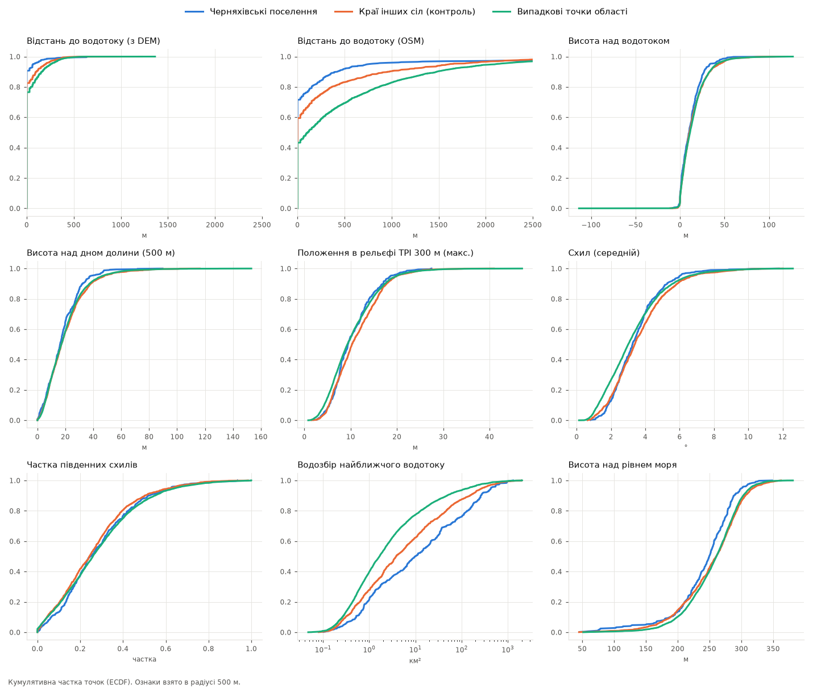
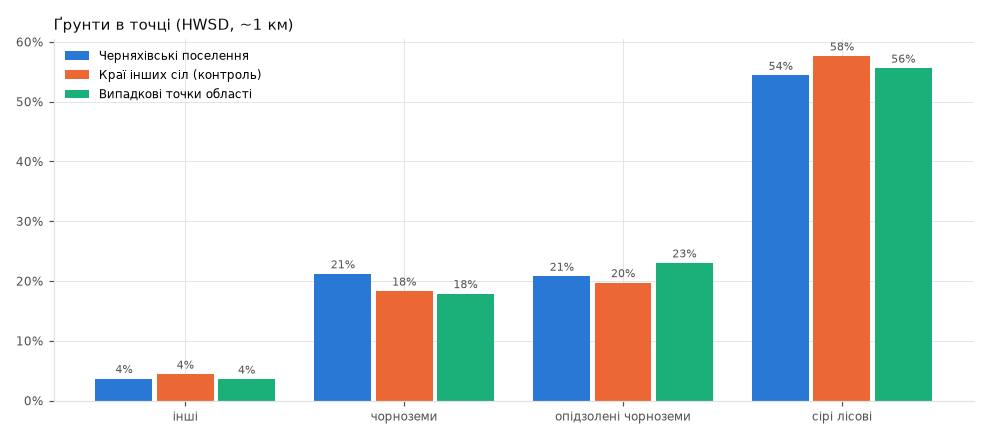

# Етап 4. Де розташовані відомі черняхівські поселення (Вінницька обл.)

Дані: 491 поселення з каталогу Магомедова (2022), геокодовані на етапі 2
(похибка ~0.5–1.5 км). Скрипт: `04_analysis.py`; числа — `results/stats.json`,
`results/features_summary.csv`; графіки — `results/*.png`.

## Як порівнювали

| Група | Що це | n |
|---|---|---|
| **Черняхівські поселення** | точки пам'яток (етап 2) | 491 |
| **Краї інших сіл (контроль)** | сучасні села БЕЗ черняхівських пам'яток, точки поставлені тим самим правилом (той самий розподіл напрямів) | 1208 |
| **Випадкові точки області** | рівномірно по області | 5000 |

Контроль «краї інших сіл» — головний: він має ту саму упередженість (пам'ятки
шукали біля сіл; геокодування теж прив'язане до сіл). Тому різниця
«поселення vs контроль» показує, чим черняхівські місця відрізняються від
**будь-якого** краю села, а не просто від середнього ландшафту.

Ознаки знято в колі 500 м навколо точки (окремий піксель при такій похибці — шум).
AUC — ймовірність, що випадкове поселення має більше значення, ніж випадкова
контрольна точка (0.5 — різниці немає; <0.5 — у поселень менше).

## Результати: рельєф і вода

| Ознака | Поселення, медіана [IQR] | Контроль | Випадкові | AUC vs контроль | AUC vs випадкові |
|---|---|---|---|---|---|
| Водозбір найбільшого водотоку в 500 м, км² | **10.1** [1.2–82] | 3.8 | 1.7 | **0.58** | **0.68** |
| Відстань до водотоку OSM, м | 0 [0–64] | 0 | 108 | 0.43 | **0.34** |
| Висота над рівнем моря, м | 250 [221–274] | 261 | 261 | 0.43 | 0.42 |
| Схил середній, ° | 3.3 [2.4–4.1] | 3.4 | 3.0 | 0.47 | 0.55 |
| Висота над водотоком (DEM), м | 10.2 [2.7–18.3] | 10.5 | 11.2 | 0.47 | 0.46 |
| Висота над дном долини, м | 16.3 [8.9–25.5] | 17.1 | 17.1 | 0.47 | 0.47 |
| TPI 300 м (макс.), м | 9.4 | 10.3 | 9.3 | 0.46 | 0.52 |
| Частка південних схилів | 0.2 | 0.2 | 0.3 | 0.53 | 0.50 |
| Відстань до водотоку (з DEM), м | 0 | 0 | 0 | — | — |

## Ґрунти (HWSD, ~1 км)

| | інші | чорноземи | опідзолені | сірі лісові |
|---|---|---|---|---|
| Поселення | 4 % | **21 %** | 21 % | 54 % |
| Контроль | 4 % | 18 % | 20 % | 58 % |
| Випадкові | 4 % | 18 % | 23 % | 56 % |

## Сусідство

| | n | медіана відстані до найближчого сусіда | Кларк–Еванс R |
|---|---|---|---|
| Поселення (окремі пам'ятки) | 491 | 1.0 км | 0.56 (кластери) |
| Поселення, рівень села | 293 | **4.1 км** [3.2–5.9] | **1.01** (випадково) |
| Контроль (краї сіл) | 1208 | 2.6 км | 1.15 (регулярно) |

Кластеризація на рівні окремих пам'яток — здебільшого наслідок того, що в одному
селі по 2–10 пунктів (і геокодування ставить їх поруч). На рівні сіл розподіл
близький до випадкового з типовим кроком ~4 км.

## Монети римської доби

Розділ 3 каталогу: 66 сіл зі знахідками монет; у **35 (53 %)** з них є й черняхівські
пам'ятки. Для порівняння: черняхівські пам'ятки відомі в ~20 % сіл області
(293 з ~1500). Зв'язок сильний, але частково це упередженість: краще обстежені
села дають і монети, і пам'ятки.

## Що з цього випливає

1. **Головна ознака — вода, і не будь-яка, а помітний водотік.** Поселення стоять
   біля потоків з водозбором ~10 км² і більше (медіана в 2.7 раза більша, ніж біля
   краю звичайного села, і в 6 разів — ніж у випадковій точці). Тобто біля
   постійних струмків і малих річок, а не у верхів'ях сухих балок.
2. **Рельєф у вікні 500 м майже не відрізняє поселення від краю села** (AUC 0.46–0.53).
   Текст каталогу каже більше, ніж DEM при такій похибці: плато/схил 42 %/42 %,
   мис 13 %, тераса 9 %, заплава 10 %; типова форма — смуга ~400 × 100 м уздовж
   берега. Це «бровка плато / верх схилу над водотоком» — масштаб, який точкам
   з похибкою ~1 км недоступний.
3. **Ґрунти — слабка ознака** на цій детальності (чорноземи 21 % vs 18 %).
   HWSD (~1 км, великі контури) не підходить для рівня поселення.
4. **Нижчі абсолютні висоти** (250 vs 261 м) — наслідок прив'язки до більших долин
   (Південний Буг, Дністер, Рось), а не окрема перевага.
5. **Сучасні села — хороший проксі.** Черняхівські місця близькі до сучасних сіл,
   і різниця між ними невелика: давні й сучасні громади обирали схожі місця.

## Обмеження

- Похибка геокодування (~0.5–1.5 км) розмиває мікрорельєф; висновки 2–3 — про
  масштаб «околиць села», не про конкретну ділянку.
- Упередженість обстежень: Хавлюк знайшов 263 з 513 пунктів; густота пам'яток
  відображає маршрути дослідників. Контроль «краї інших сіл» частково це знімає,
  але не повністю (села без знахідок могли просто не обстежуватися).
- Мережа водотоків з DEM з порогом 0.5 км² надто густа: «відстань до водотоку»
  в 500 м завжди ~0 → неінформативна. Інформативний розмір водотоку (водозбір).
- Copernicus DSM включає ліс; HWSD грубий.

## Рекомендації для етапу 5 (модель)

- Предиктори: log водозбору найближчого водотоку, відстань до водотоку з
  водозбором ≥ 5–10 км², висота над ним, TPI/форма рельєфу на масштабі 300–1000 м,
  схил, експозиція; ґрунти — як слабкий.
- Фон — з поправкою на обстеження (точки біля сіл, як контроль тут), просторова
  крос-валідація за басейнами.
- Покращити геокодування: для B-точок, де вказано берег і водойму, «прилипати»
  до найближчого берега відповідного водотоку в заданому напрямі — це зменшить
  похибку і дасть шанс побачити мікрорельєф (бровка/схил).
