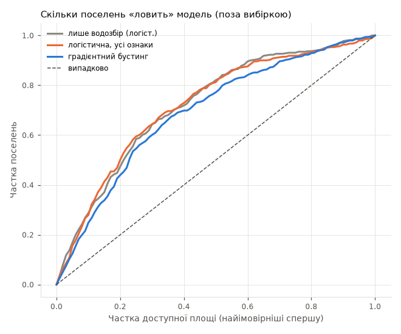
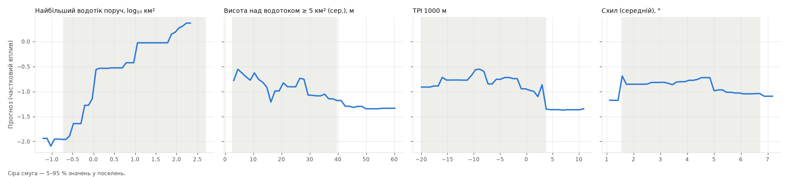
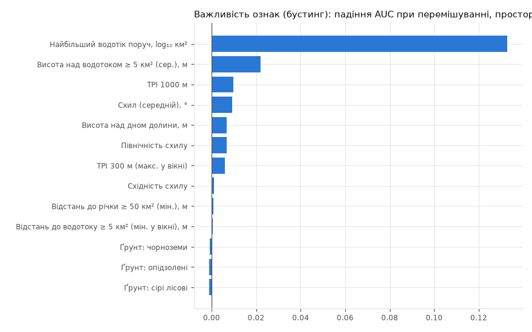
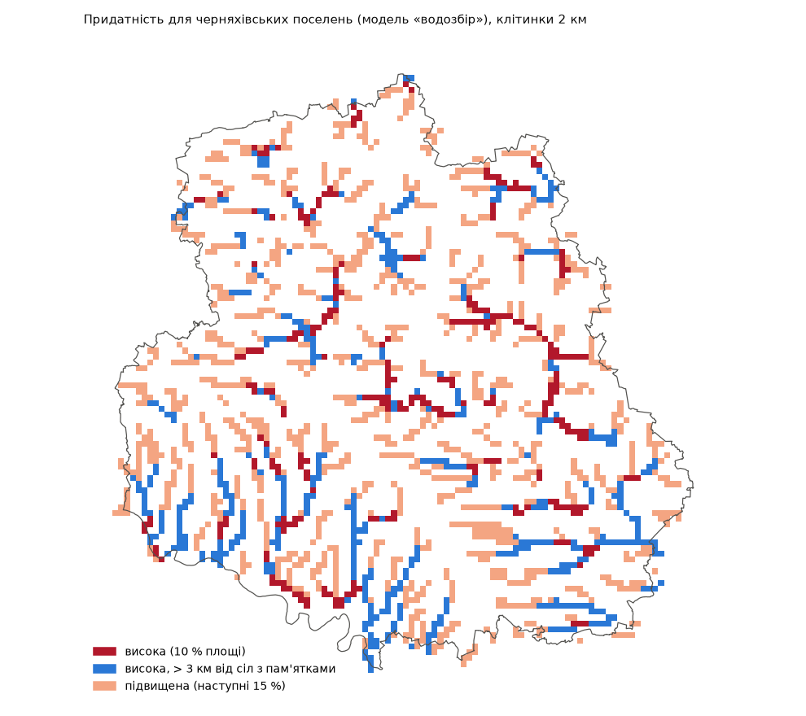

# Етап 5.2–5.3. Прогнозна модель: поселення проти фону (2026-10-08)

Мета: оцінити, наскільки можна передбачити місця черняхівських поселень з рельєфу
й води, і зробити основу для карти «де ще шукати» (крок 5.4). Попередні кроки:
`analysis.md` (етап 4), `refine.md` (крок 5.1 — прив'язка до берега).

**Підсумок.** Модель працює, але фактично зводиться до одного правила: **поселення
стоять біля більших водотоків**. Рельєф, експозиція й ґрунти поза вибіркою нічого
не додають. Чесна оцінка на рівні сіл — AUC ≈ 0.61: помітно краще за випадковість,
але це звуження районів пошуку, а не вказівка на конкретні ділянки.

## Відтворення

```
.venv/Scripts/python -m pip install scikit-learn      # один раз
.venv/Scripts/python -X utf8 research/chernyakhiv/05c_model.py   # ~1 хв
```

Скрипт: `05c_model.py`. Числа — `results/model_stats.json`; графіки —
`results/model_capture.png`, `model_importance.png`, `model_partial.png`.
Карта (растр і публічний шар) — окремим скриптом `05d_map.py`, див. «Крок 5.4».
Тести: `tests/test_chernyakhiv_model.py`.

## Дані

- **Присутність:** 491 поселення в уточнених положеннях (`sites_refined`, крок 5.1).
- **Фон:** 5000 випадкових точок області, відібраних так, щоб їхня відстань до
  сучасної забудови мала той самий розподіл, що й у пам'яток (половина пам'яток
  стоїть у межах або на краю села — так їх знаходили й так їх геокодовано). Модель
  порівнює місця поселень з тим, що було **доступне біля сіл**; сама відстань до
  забудови не є ознакою. Фон НЕ прив'язується до води (на відміну від контролю в
  кроці 5.1): він має показувати доступні місця, а не береги.

## Ознаки

Усі — растри 30 м, взяті **у вікні ±240 м**, а не в точці:

| Ознака | Як |
|---|---|
| Найбільший водотік поруч | log₁₀ макс. водозбору у вікні |
| Відстань до водотоку ≥ 5 км² | мін. у вікні (обмеж. 3 км) |
| Висота над водотоком ≥ 5 км² | середня у вікні |
| Відстань до річки ≥ 50 км² | мін. у вікні (обмеж. 10 км) |
| TPI 300 м | макс. у вікні (бровка поруч) |
| TPI 1000 м, висота над дном долини | середні |
| Схил, північність, східність | середні |
| Ґрунти HWSD | клас у точці (one-hot) |

Абсолютна висота не використовується: вона здебільшого кодує регіон (великі
долини, маршрути дослідників), а не вибір місця.

**Чому вікно, а не точка — знайдений артефакт.** Перша версія брала значення в
точці. Бустинг дав AUC 0.79 і «ловив» 57 % поселень у 10 % площі, а головною
ознакою стала точна відстань до водотоку. Причина: крок 5.1 ставить прив'язані
пам'ятки рівно за 150 м від русла — 53 % пам'яток мали відстань 120–180 м проти 4 %
випадкових точок. Модель вивчала відступ, а не ландшафт. Віконні ознаки цей слід
прибирають; справжнє положення пам'ятки й так відоме з точністю до сотень метрів.

## Моделі й перевірка

- **Лише водозбір** — логістична регресія на двох ознаках (найбільший водотік
  поруч, відстань до водотоку ≥ 5 км²). База.
- **Логістична, усі ознаки** (+ квадрати, регуляризація C = 0.3).
- **Градієнтний бустинг** (глибина 3, 300 ітерацій, мін. 40 у листі).
- **Просторова крос-валідація:** блоки 25 × 25 км випадково розподілені на 5 фолдів,
  3 повтори (15 фолдів). Модель перевіряється на блоках, яких не бачила.

## Результати (поза вибіркою)

| Метрика | Лише водозбір | Логістична | Бустинг |
|---|---|---|---|
| AUC, поселення vs фон (сер. по фолдах ± sd) | **0.72** ± 0.03 | 0.71 ± 0.03 | 0.69 ± 0.03 |
| Індекс Бойса | 0.93 | 0.92 | 0.98 |
| Поселень у 10 % найпридатнішої площі | 28 % | 26 % | 24 % |
| Поселень у 20 % найпридатнішої площі | **47 %** | 48 % | 43 % |
| AUC на рівні сіл (карта з КВ, p90 у 2 км) | 0.61 | 0.61 | 0.62 |

Для порівняння на рівні сіл: найбільший водотік у 2 км **без жодної моделі** —
AUC 0.61.



Як читати:
- **AUC 0.72** — частково завищено: присутності прив'язані до води з тексту
  каталогу, а сходинки на кривій водозбору рівно на 1 і 10 км² — це пороги
  прив'язки з кроку 5.1 (див. графік нижче). Сам зв'язок справжній, але його сила
  в цій метриці перебільшена.
- **Перевірка на рівні сіл — головна чесна оцінка.** Вона не залежить ні від
  прив'язки, ні від похибки геокодування: координати сіл точні, а пам'ятка або є
  біля села, або ні. Тут модель = «найбільший водотік поруч», AUC ≈ 0.61. Медіанний
  найбільший водозбір у радіусі 1 км: 53 км² біля сіл з пам'ятками проти 18 км² біля
  інших.
- **Складніші моделі нічого не додають**: логістична з усіма ознаками й бустинг
  не кращі за двохознакову базу, а бустинг навіть трохи гірший (перенавчається на
  шумі).
- **Індекс Бойса 0.93–0.98** — прогноз монотонний: що вища оцінка, то частіше там
  поселення. Тобто як ранжування карта коректна.
- 20 % доступної площі містять ~47 % поселень — приблизно в 2.4 раза щільніше за
  середнє.





Важливість (бустинг, падіння AUC при перемішуванні): найбільший водотік поруч
0.13; усе інше ≤ 0.02 (висота над водотоком 0.02, TPI 1000 м, схил, висота над дном
долини, північність ~0.01); ґрунти — 0. Логістична регресія показує ті самі слабкі
тенденції: нижче над водотоком, але вище над дном долини, трохи частіше на
не-північних схилах.

## Додаткові перевірки на артефакти

| Тест | Лише водозбір | Логістична | Бустинг |
|---|---|---|---|
| AUC: модель з уточнених точок, пам'ятки в положеннях етапу 2 | 0.55 | 0.54 | 0.54 |
| AUC: лише 116 неприв'язаних пам'яток | 0.49 | 0.47 | 0.47 |

- Положення етапу 2 зсунуті на 300–1000 м, а сигнал локальний (±240 м), тож шум
  його майже затирає. Цей тест показує, що ознаки дуже чутливі до точності
  положення, але не розрізняє, артефакт це чи ні.
- 116 неприв'язаних пам'яток — ті, в описі яких **немає води**. Модель їх не
  розпізнає (≈ 0.5). Це не обов'язково вада: це інша група (плато без згадки води),
  і водна модель її в принципі не покриває. Для карти пошуку це означає: приблизно
  кожне четверте поселення стоїть так, що «водне» правило його не знайде.

## Висновки для карти (крок 5.4)

1. Основа карти — **розмір найближчого водотоку**. Складна модель не виправдана:
   краще проста, прозора оцінка (логістична «лише водозбір»), яку легко пояснити в
   легенді.
2. Масштаб — 1–2 км (рішення 1) — якраз той, на якому оцінка перевірена (рівень
   сіл).
3. Очікувана якість — помірна (AUC ~0.6 на рівні сіл): карта звужує райони
   пошуку, а не вказує ділянки. Це треба написати в застереженні.
4. «Кандидати для обстежень»: зони високої оцінки без відомих пам'яток поруч. Але
   відсутність пам'яток може означати й те, що там ніхто не шукав (упередженість
   обстежень), — треба врахувати маршрути (Хавлюк — 263 з 513 пунктів).

---

# Крок 5.4. Карта придатності

Скрипт: `05d_map.py` (~40 с). Модель — логістична «лише водозбір» (два параметри;
див. вище: складніші не кращі), навчена на всіх поселеннях. Придатність —
перцентиль серед фонових (доступних) точок, 0–100.

| Вихід | Де | Доступ |
|---|---|---|
| Растр придатності 150 м | `data/processed/chernyakhiv_model/suitability_150m.tif` | лише локально |
| Клітинки 2 × 2 км, класи | `docs/data/chernyakhiv_potential.geojson` (111 КБ) | публічний (рішення 1) |
| Прев'ю й числа | `results/potential_map.png`, `results/map_stats.json` | у репозиторії |

Клітинка оцінюється 90-м перцентилем придатності всередині (як у перевірці на рівні
сіл). Класи — за часткою клітинок області: **висока** — 10 % (739 клітинок),
**підвищена** — наступні 15 % (1104). **Кандидат** — висока клітинка, центр якої
далі 3 км від усіх сіл з відомими пам'ятками (453 з 739).



Карта повторює мережу середніх і великих водотоків. Прямі «смуги» на південному
сході й півдні — не артефакт: там річки течуть майже точно зі сходу на захід і з
півночі на південь (перевірено накладанням річок OSM); «драбинку» дає сітка 2 км.

**Перевірка на селах** (клас клітинки, в якій стоїть село):

| | висока | підвищена | поза класами |
|---|---|---|---|
| Частка площі | 10 % | 15 % | 75 % |
| Села з пам'ятками (299) | **27 %** | 29 % | 44 % |
| Інші села (1202) | 18 % | 22 % | 60 % |

У класі «висока» сіл з пам'ятками в 2.7 раза більше, ніж за часткою площі, і в
1.5 раза більше, ніж інших сіл. Сучасні села й самі тяжіють до більших водотоків
(18 % проти 10 % площі), тому порівнювати чесніше з іншими селами.

Обмеження (для застереження на сайті):
- Оцінка — лише «біля якого водотоку»; рельєф, ґрунти й історичні чинники не
  враховано. Помірна якість: AUC ≈ 0.6 на рівні сіл.
- ~24 % відомих поселень (без води в описі) модель не «бачить».
- «Кандидати» — це місця, де пам'яток не відомо, але причина може бути й у тому,
  що там ніхто не шукав. 61 % високих клітинок — кандидати, тобто фільтр поки
  слабо вибірковий; маршрутів обстежень у даних немає.
- Карта показує придатність ландшафту, а не наявність пам'яток.
