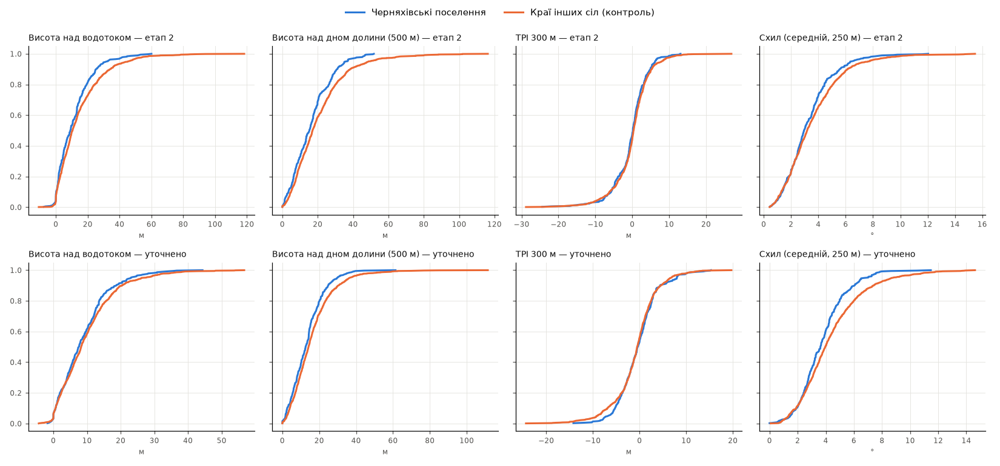

# Етап 5.1. Уточнення положення пам'яток: «прилипання» до берега (2026-10-08)

Перший крок етапу 5 (прогнозна модель; план — `PLAN.md`, розділ 5). Мета: зменшити
похибку геокодування етапу 2 (~0.5–1.5 км) там, де опис каталогу називає водойму
й берег («на лівому березі р. Мурашка»), і перевірити, чи стануть інформативнішими
ознаки рельєфу, які на етапі 4 майже не розрізняли поселення й контроль
(`analysis.md`).

Підсумок: 375 з 491 поселень прив'язано до берега водотоку з опису. Похибка
зменшилась помірно (медіана зсуву 290 м); рельєф як ознака сильнішим не став,
а розмір водотоку посилився.

## Відтворення

```
.venv/Scripts/python -X utf8 research/chernyakhiv/01_parse_catalog.py   # якщо змінювався парсер
.venv/Scripts/python -X utf8 research/chernyakhiv/02_geocode.py         # ~12 с
.venv/Scripts/python -X utf8 research/chernyakhiv/05a_refine.py         # ~20 с
```

Скрипт: `05a_refine.py`; числа — `results/refine_stats.json`, графік —
`results/refine_ecdf.png`; уточнені точки — шар `sites_refined` у
`data/processed/chernyakhiv_sites.gpkg` (лише локально, рішення 1 у PLAN.md;
колонки `water_class`, `bank_used`, `snap_how` = named/dem/none, `channel_km2`,
`shift_m`). Тести: `tests/test_chernyakhiv_refine.py` (синтетичний растр, локальні
дані не потрібні).

Зміни в попередніх етапах:
- `02_geocode.py` зберігає координати опорного села (`anchor_x`, `anchor_y`; для
  записів із `ref_village` — іншого села) — потрібні для сектора напряму.
  Положення точок етапу 2 і публічний шар не змінились.
- `01_parse_catalog.py` — виправлення «рік ≠ річка» (див. «Побічні знахідки»).

## Як

1. Водотік — комірки DEM-мережі (`flow_acc_km2`) з порогом за типом з опису:
   «р.» ≥ 10 км² (якщо такої немає у вікні — ≥ 1 км², бо «р.» буває й малою
   річкою), струмок/ставок ≥ 1 км², балка ≥ 0.3 км². Якщо водойма названа і є
   в OSM ближче 5 км від села — лише комірки до 250 м від цієї лінії.
2. Вікно 1.5 км від точки етапу 2, сектор ±67.5° від села в напрямі з опису.
3. Найближча така комірка; напрям течії — за зростанням водозбору (збігається з
   напрямом ліній OSM у 556 з 565 перевірок, 98 %); точка зсувається на
   **фіксовані 150 м** на вказаний берег (лівий/правий — за течією) або, якщо берег
   не вказано, — у бік точки етапу 2. Відступ фіксований навмисно: підбір за
   рельєфом зробив би перевірку рельєфу замкненим колом.
4. Контроль «краї інших сіл» проходить ту саму процедуру з класом водойми й
   берегом, випадково взятими з розподілу пам'яток.

## Результат

| | n |
|---|---|
| Уточнено за названою водоймою (OSM) | 94 |
| Уточнено за типом водойми (DEM) | 281 |
| Не уточнено (у тексті немає ні берега, ні водойми) | 116 |

Зміщення: медіана **290 м** [IQR 130–510], 90 % — до 830 м. Тобто похибка етапу 2
була здебільшого в межах заявлених 0.5–1 км.

**Перевірка за текстом** (чи відповідає рельєф у точці опису «плато/мис» vs
«заплава/тераса»; 187 vs 46 уточнених пам'яток; AUC):

| Ознака | етап 2 | уточнено | ΔAUC [95 % ДІ, бутстреп] |
|---|---|---|---|
| Висота над водотоком | 0.63 | **0.68** | +0.05 [−0.05; 0.16] |
| Висота над дном долини | 0.62 | **0.66** | +0.04 [−0.06; 0.14] |
| TPI 300 м | 0.56 | **0.60** | +0.04 [−0.08; 0.16] |
| Схил (250 м) | 0.58 | **0.64** | +0.06 [−0.03; 0.16] |

Усі чотири зсунулись у правильний бік, але жодна окремо не значуща (мала група
«низина»). Висновок: уточнення, імовірно, наближає точки до справжніх місць, але
виграш помірний.

**Поселення vs контроль** (обидва уточнені тим самим правилом; AUC):

| Ознака | етап 2 | уточнено |
|---|---|---|
| Водозбір найбільшого водотоку в 250 м | 0.56 | **0.62** |
| Висота над водотоком | 0.45 | 0.47 |
| Висота над дном долини | 0.43 | 0.44 |
| TPI 300 / 1000 м | 0.48 / 0.46 | 0.52 / 0.52 |
| Схил | 0.47 | **0.43** |
| Висота н.р.м. | 0.43 | 0.44 |



Що це означає:
- Розмір водотоку посилився як головна ознака (AUC 0.56 → 0.62): біля води
  потрібного типу поселення стоять при більших потоках, ніж край звичайного села.
- Рельєф відносно контролю так і не розрізняє: на березі того самого класу водотоку
  черняхівські місця за висотою над водою й TPI майже такі самі, як біля сучасних сіл.
  Помітне одне — **пологіші схили** (AUC 0.43: поселення на м'якших схилах, ніж
  випадкове місце біля води). Для моделі: рельєф — додаткові ознаки, не основні.

## Побічні знахідки

- **Вада парсера етапу 1:** «у 2003 р.» (рік) читалося як «р.» (річка) →
  `water_name` = «Потупчик», «Матеріали», «Закладено». Виправлено (`NOT_YEAR`),
  тест додано. Частка «річка» серед поселень: 46 % → **40 %**.
- 34 пам'ятки мають названу річку, лінія якої в OSM далі 3 км від села; усі
  збіги сіл однозначні — це однойменні різні водотоки («Безіменна», малий «Самець»)
  або неповні лінії OSM, а не помилки геокодування. Такі назви ігноруються (> 5 км).

## Перевірки коректності

- **Напрям течії** (від нього залежить лівий/правий берег): у 565 випадкових
  точках на лініях водотоків OSM (лінії OSM малюються за течією) напрям, оцінений
  за зростанням водозбору DEM, збігся в 556 (98 %).
- **Невдалі прив'язки «річкових» пам'яток** розібрано вручну: частина — малі
  річки (Коза 9.3 км², Вишенька, Рівець) → додано запасний поріг 1 км²; частина —
  хибні «річки» з вади парсера.
- **Значущість покращення** перевірки за текстом — парний бутстреп різниці AUC
  (2000 повторів, таблиця вище).
- Публічний шар `docs/data/chernyakhiv_villages.geojson` після перезапуску
  етапу 2 не змінився.

## Інструменти

- black і ruff запускати з `--config preprocessing/pyproject.toml`
  (line-length 100): з кореня репозиторію конфіг не підхоплюється, і black
  переформатовує файли під 88 символів. Наявні зауваження ruff у `preprocessing/`
  (UP031 тощо) — старі, від новіших версій інструментів; у цьому кроці не чіпались.
- Тести: 39 зелених.
- Підступ: колонки `snap` і `type` у GeoDataFrame затіняються методом/атрибутом
  (`gdf.snap`, `gdf.type`) — звертатись лише як `gdf["..."]`; тому колонка
  називається `snap_how`.

## Далі

Етап 5, крок 2 — модель presence–background на `sites_refined`. Контроль
уточнювати тим самим правилом (функції `snap` і `pseudo_with_anchors` з
`05a_refine.py`), інакше поселення будуть ближче до води просто за побудовою.
Ознаки: водозбір найближчого водотоку — головна; рельєф (висота над водотоком,
TPI, схил) — додаткові.
